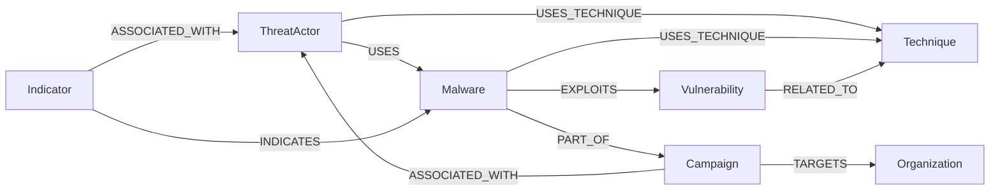

# ThreatGraph

A read-only cybersecurity threat-intelligence explorer built on **CognoDB**, a managed
graph database. ThreatGraph lets you browse threat actors, malware, vulnerabilities,
MITRE ATT&CK techniques, campaigns, targeted organizations, and indicators of
compromise (IOCs), then trace how they connect to each other — including through
relationship patterns that would be painful to express in a relational schema.

> **Data note:** every entity in the seed dataset is synthetic or drawn from public
> taxonomy (MITRE ATT&CK technique IDs/names). Indicator values use IP ranges and
> domain suffixes reserved for documentation (RFC 5737 / RFC 2606) — nothing in this
> dataset points at real infrastructure or makes a real attribution claim.

---

## Why a graph database

The core question this tool answers — *"how is this threat actor connected to that
organization, through however many campaigns, malware families, or shared
techniques it takes?"* — is a variable-depth traversal across several different
relationship types. In a relational schema that's a hand-written recursive CTE (or a
UNION of one CTE per relationship-type join path) that has to be rewritten every time
the schema grows a new relationship type. In Cypher it's one pattern:

```cypher
MATCH p = (ta:ThreatActor {id: $actorId})
          -[:USES|EXPLOITS|USES_TECHNIQUE|PART_OF|TARGETS|ASSOCIATED_WITH|INDICATES|RELATED_TO*1..5]-
          (target:Organization)
WHERE ta <> target
RETURN target, length(p) AS hops
ORDER BY hops ASC
```

That's `GET /api/investigations/reachability/{actorId}` — see [Query 4](#query-4--relationally-awkward-reachability) below.

---

## Data model

7 node types, 8 relationship types:



| Node | Key properties | Count (seed) |
|---|---|---|
| `ThreatActor` | name, motivation, origin, aliases | 12 |
| `Malware` | name, type, platform | 20 |
| `Vulnerability` | cve, severity, affected_product | 24 |
| `Technique` | name (MITRE ATT&CK id + name), tactic | 16 |
| `Campaign` | name, year | 16 |
| `Organization` | name, industry, country | 20 |
| `Indicator` | type (ip/domain/sha256/url), value, confidence | 30 |

Every node also carries an `id` (e.g. `ta-01`, `mw-14`) and a precomputed lowercase
`search_text` used by the search endpoint.

---

## The six required queries

| # | Endpoint | What it does |
|---|---|---|
| 1 | `GET /api/search?q=` | Free-text search across all seven node types via a precomputed `search_text` property. |
| 2 | `GET /api/entities/{id}` | Entity properties + every direct neighbor, with relationship type and direction. |
| 3 | `GET /api/investigations/campaign-trail/{actorId}` | **Mandatory multi-hop investigation.** `ThreatActor <- Campaign -> Organization`, with the `Malware` used in that campaign attached. |
| 4 | `GET /api/investigations/reachability/{actorId}?max_hops=` | **Relationally-awkward query.** Every `Organization` reachable within N hops through *any* relationship type/direction — a variable-length pattern match. |
| 5 | `GET /api/entities/{id}` (`related`) | Related/connected entities for any node (shared implementation with Query 2 — see `entity_service.get_entity_detail`). |
| 6 | `GET /api/stats` | Dashboard aggregate counts per type, total relationships, vulnerability severity breakdown, technique-by-tactic breakdown. |

Full Cypher for each lives in `backend/app/repositories/`, one file per concern
(`entity_repository.py`, `search_repository.py`, `investigation_repository.py`,
`stats_repository.py`) — see [INTERVIEW_GUIDE.md](./INTERVIEW_GUIDE.md) for a
line-by-line walkthrough of each query and the design decisions behind it.

### Query 4 — relationally-awkward reachability

Given a threat actor, find every organization reachable within *N* hops, through
*any combination* of the eight relationship types, in either direction. This models
a real analyst question ("could this actor plausibly have touched this org, even
indirectly?") that has no fixed shape — which is exactly what's awkward to express
with foreign keys and easy to express as a variable-length graph pattern.

---

## Project structure

```
threatgraph/
├── backend/            FastAPI + neo4j driver
│   ├── app/
│   │   ├── config.py       settings from environment variables
│   │   ├── db.py           driver lifecycle, error translation
│   │   ├── models/         Pydantic schemas
│   │   ├── repositories/   Cypher lives here, one file per concern
│   │   ├── services/       business logic between routes and repositories
│   │   ├── routes/         FastAPI routers
│   │   └── main.py         app wiring, CORS, exception handlers
│   ├── scripts/
│   │   ├── data.py         raw seed dataset (deterministic, seed=42)
│   │   ├── seed_data.py    idempotent loader (MERGE-based) + relationship wiring
│   │   └── schema.py       uniqueness constraints
│   └── tests/               pytest suite, stubbed at the db.run_query seam
├── frontend/           React + Vite + TypeScript + Tailwind
│   └── src/
│       ├── api/client.ts        typed fetch wrapper
│       ├── components/          RelationshipGraph (hand-written force layout), cards, badges
│       ├── pages/                Dashboard, Explorer, EntityDetail, Investigate
│       └── lib/entityTypeMeta.ts single source of truth for per-type color/labels
├── render.yaml         Render blueprint for the backend
└── docs/screenshots/    drop screenshots here before submitting
```

---

## Running it locally

### 1. CognoDB instance

You'll need a CognoDB instance URI, username, and password (Bolt protocol,
Neo4j-compatible). Never commit these — they only ever go in a local `.env` file or
your hosting provider's secret env var store.

### 2. Backend

```bash
cd backend
python -m venv .venv && source .venv/bin/activate   # Windows: .venv\Scripts\activate
pip install -r requirements.txt
cp .env.example .env        # then fill in your real CognoDB credentials
python -m scripts.seed_data # creates constraints + loads the dataset (idempotent)
uvicorn app.main:app --reload --port 8000
```

Visit `http://localhost:8000/health` — you should see `{"status":"ok","database_connected":true}`.
Interactive API docs are at `http://localhost:8000/docs` (FastAPI's built-in Swagger UI).

### 3. Frontend

```bash
cd frontend
npm install
cp .env.example .env.local   # leave VITE_API_BASE_URL empty for local dev
npm run dev
```

Visit `http://localhost:5173`. The Vite dev server proxies `/api` and `/health` to
`localhost:8000`, so no CORS setup is needed locally.

### 4. Tests

```bash
cd backend
pytest -q
```

The suite stubs `app.db.run_query` — the single seam where the app talks to CognoDB —
so it runs in well under a second with no live database required, while still
exercising the real repository, service, and route code.

---

## Deploying

- **Backend** — `render.yaml` is a ready-to-use Render blueprint (Docker-based).
  Set `COGNODB_URI` / `COGNODB_USERNAME` / `COGNODB_PASSWORD` as secret env vars in
  the Render dashboard, not in the repo. Railway works the same way using
  `backend/Dockerfile` directly.
- **Frontend** — any static host works (Vercel, Netlify). Build command
  `npm run build` from `frontend/`, output directory `frontend/dist`. Set
  `VITE_API_BASE_URL` to your deployed backend's URL as a build-time env var.

---

## Known limitations

- `CONTAINS`-based search isn't backed by a full-text index, so it won't scale past
  the free-tier dataset size here without adding a proper full-text index (left out
  because CognoDB's free-tier support for `db.index.fulltext` wasn't something I
  wanted to depend on without verifying against your instance first).
- Node labels and relationship types can't be parameterized by the Bolt protocol —
  the handful of places that embed one in an f-string only ever receive a value
  already validated against a fixed `Literal` type, never raw user input. Flagged
  explicitly in the docstrings of `entity_repository.py` and
  `investigation_repository.py`.
- The relationship graph visualization is a small hand-written force simulation
  (see `RelationshipGraph.tsx`), not a charting library — fine for the handful of
  nodes a single entity or investigation surfaces, not built to visualize the whole
  graph at once.

See [INTERVIEW_GUIDE.md](./INTERVIEW_GUIDE.md) for the deeper design rationale and
[DEMO_SCRIPT.md](./DEMO_SCRIPT.md) for a walkthrough script.
